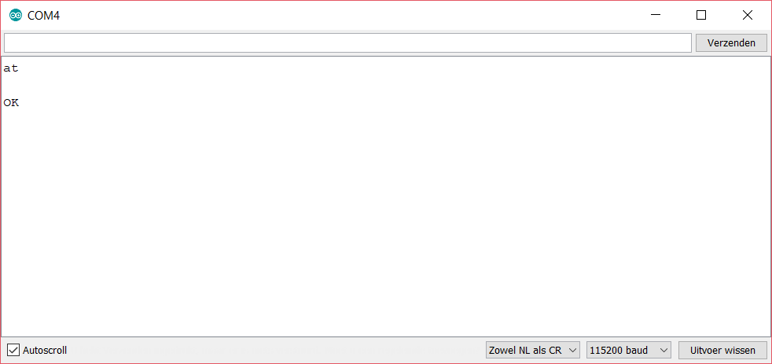

# Wifi Localization sketch
---
The sketch is built upon the use of the following hardware and components:

* Sodaq Explorer
* ESP8266-01
* FTDI usb to serial
* Breadboard
* 2-3 Resistors
* A couple of male-female and male-male wires. 

### Index
---
* Important values/calculations
* Flow of the program
* Functions
* Hookup guide


### Important values/calculations
---
>`
#define HEX_CHAR_TO_NIBBLE(c) ((c >= 'a') ? (c - 'a' + 0x0A) : (c - '0')) 
`
`
#define HEX_PAIR_TO_BYTE(h, l) ((HEX_CHAR_TO_NIBBLE(h) << 4) + HEX_CHAR_TO_NIBBLE(l))
`

The above calculations turn a hex value into a byte value. In the ` HEX_PAIR_TO_BYTE ` the ` HEX_CHAR_TO_NIBBLE` is called. Here a single char is evaluated and changed accordingly. 

> `
#define ESP_SERIAL_SPEED 9600
`

The standard speed of the ESP8266-01 module is 115200. This can be changed by communicating to the device directly and using the following command: ***AT+CIOBAUD=*** *Desired serial speed e.g.* **9600** 
(Note: The default speed cannot be used with the explorer board, as its serial port can only handle up to 57600). More information can be found in the chapter: *hookup guide*
>`
#define ACCESS_POINTS 3
`
`
#define SF_WIFI_BSSID_SIZE 6
`
`
byte aps[ACCESS_POINTS][SF_WIFI_BSSID_SIZE];
`

The above declarations are another important part of the code. They define the number of Bssid's that are scanned for. By changing the value of `ACCESS_POINTS` you can scan for more Bssid's.


### Flow of the program
---
* At the start of the loop a connection with the ESP is tested. The explorer sets the ESP into host mode with the following command: `AT+CWMODE=1` .
* If the connection is not working. It retries until it does. The `waitForOK` function is used for this, see the chapter: *Functions* for more information.
* When a connection is confirmed it continues and sends the command to scan for WiFi networks `AT+CWLAP`. 
* Then it stays in a loop as long as `millis() < timeout && bssidNumber < ACCESS_POINTS` is true.
* The `readLine` function is then called, see the chapter: *Functions* for more information.
* When the string comes back, it checks if there is a valid response. Which is `+CWLAP`
* The string is then further processed. By breaking it in smaller tokens.
* The fourth token is the Bssid.
* The fourth token is then proofed, if this is successful the Bssid is put into an array.
* This is done by using the ` HEX_PAIR_TO_BYTE`.
* If all the Bssid’s have been collected, the array is put into the payload array through the `sendBssid`   function.
* The payload is sent to the console and after a delay of a minute everything is repeated.

### Functions
---
The following functions are used in the sketch: `WaitForOK`, `readLine`, `sendBssid`.
```
bool waitForOK(uint32_t waitTime) 
{
  uint32_t timeout = millis() + waitTime;
    while (millis() < timeout) 
    {
      uint8_t l = espSerial.readBytesUntil('\n', buffer, SF_ESP8266_BUFFER_SIZE);
        if (l > 0 && strncmp("OK", buffer, 2) == 0) 
        {
          return true;
        }
      delay(1);
    }
  return false;
}
```
The `waitForOK` function is used at the start of the loop to check if the communication with the ESP is up and running. It puts the data that is sent by the ESP in a buffer which is then checked if it contains the *OK* string by using the `strncmp` function. At the very end of a response, from the ESP these two characters are always present. So, these make a good end marker.

```
char* readLine(uint32_t waitTime) 
{
  uint32_t timeout = millis() + waitTime;
    while (millis() < timeout) 
    {
      uint8_t l = espSerial.readBytesUntil('\n', buffer, SF_ESP8266_BUFFER_SIZE);
        if (l > 0) 
        {
          buffer[l-1] = '\0';
          return buffer;
        }
      delay(1);
    }
  return NULL;
}
```
The `readLine` function is similar to the `waitForOk` function. The biggest difference being the return of the buffer, instead of checking it in the function. The buffer is returned because the string that is sent from the ESP this time contains the information we need for the Wifi-localization. 

```
void sendBssid() 
{
  byte payload[payloadLength];
  uint8_t payloadByte = 0;
  
  for(bssidNumber = 0; bssidNumber < ACCESS_POINTS; bssidNumber++)
  {
    for(bssidByte = 0; bssidByte < SF_WIFI_BSSID_SIZE; bssidByte++, payloadByte++)
    {
      payload[payloadByte]= aps[bssidNumber][bssidByte];
    }
  }

  ttn.sendBytes(payload, sizeof(payload));
  delay(60000);
}
```
The `sendBssid` function is used to send the collected Bssid’s over LoRa to the TTN console. By going through two for loops it fills out the payload with the `bssidByte` at the right places.

### Hookup guide
---
##### **Safety**
It is not wise to connect the ESP module directly to the Explorer, as the ESP module is a 3.3 V device and the Explorer is a 5 V device. By doing so the ESP could get irreversibly damaged. The Explorer board has a 3.3 V pin so this can be used to power the ESP, but the TX pin swings between 0-5 V.
There are two main methods to make it safer. The first is using a resistor divider network to adjust the 5 V of the TX pin. The second method involves another component, called a level shifter. There are small boards with level shifters on it, that can be order from a variety of places. As the first method will do the job just fine, we will be using this for simplicity’s sake.

[Graphic: explorer -> esp]

For the resistor values you can take a multitude of values, as long as the second resistor has double the value as the first resistor. *E.G.*. 1K and 2K.
By connecting the Explorer and ESP this way it is possible to communicate in a safe fashion.

##### **Communication**

Now the safety is taken care off, the next step is actually communicating with the device. To be able to communicate with the ESP module, it is necessary to set the correct baud rate. If the ESP module comes preconfigured with a baud rate of 115200, it is not possible to configure the module with explorer board. As the serials ports of the explorer only go up to 57600. 

A way to find out the baud rate of the module is to try an edited passthrough sketch from the TTN library. 

``` 
#define debugSerial SerialUSB
#define espSerial Serial // D0 & D1

void setup()
{
  while (!debugSerial);

  debugSerial.begin(9600);
/*
possible baud rates to try: 9600, 19200, 38400, 57600. Don’t forget to change the baud rate in the serial monitor accordingly
*/
  delay(500);
  espSerial.begin (9600); 
 
  debugSerial.println(F("Check if the communication with your ESP module is working by entering the following command 'AT'. Response should be ‘OK’ "));
  debugSerial.println(F("Check the baudrate of your ESP module by entering the following command 'AT+CIOBAUD?' "));
}

void loop()
{
  while (debugSerial.available())
  {
    espSerial.write(debugSerial.read());
  }
  while (espSerial.available())
  {
    debugSerial.write(espSerial.read());
  }
}
```
There are allot of ‘AT’ commands you can send to the device, to configure or check settings. A good reference guide can be found here: [AT commands guide](https://room-15.github.io/blog/2015/03/26/esp8266-at-command-reference/) 

A good response looks like this. 



If you are only getting back garbage values like seen here. 


Some extra hardware will be needed. For our use case, a FTDI programmer was used. There are other methods to configure the ESP, but we will only be looking at the FTDI one. 

With the FTDI it is possible to connect the ESP directly to a pc, and issue commands. The following FTDI was used: [*FTDI FT232RL USB to TTL*](https://www.amazon.com/HiLetgo-FT232RL-Converter-Adapter-Breakout/dp/B00IJXZQ7C/ref=pd_lpo_vtph_147_lp_img_3/131-9012372-9811114?_encoding=UTF8&psc=1&refRID=PH0S6PBC54E7YFZYEKZD) 

When the ESP is connected to your pc through you FTDI, it is possible to communicate with the device. This can be done with your preferred serial terminal program, *E.G.* Putty, Termite, Minicom. To name a few. It is also possible to use the arduino serial monitor. The only parameter you need to know is the serial port with which the ESP is connected and the baud rate. 
The serial port can be found in the Arduino IDE, under the `tools section`,


or in the `device manager` (Windows),


`System Information` (OSX)


The different baud rates can be tried until one that works is found (which will probably be 115200).

##### TODO
---
* Remove redundant Bssid’s
* Add signal strength sorting (char *signalSort(buffer[] enter it after the readline)
* Make the payload function scalable 
