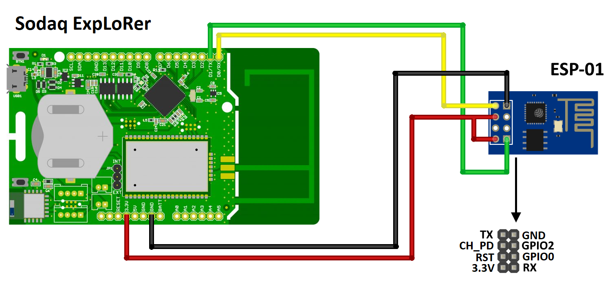
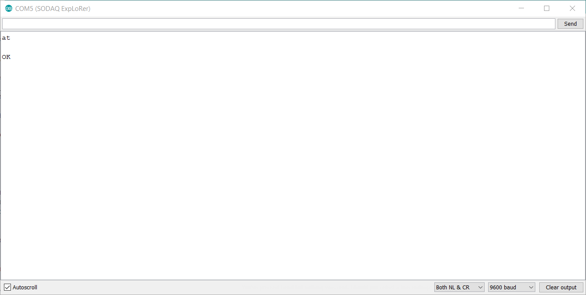
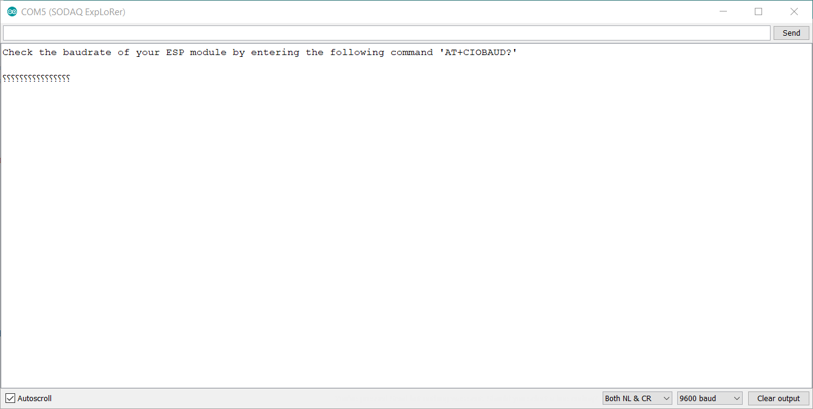
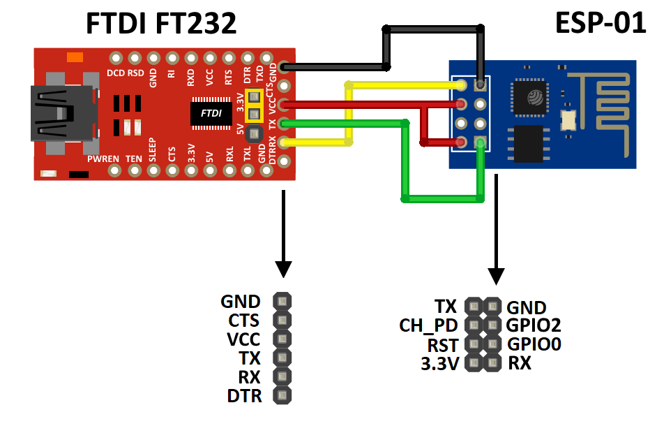

# Wifi Localization sketch

The sketch is built upon the use of the following hardware and components:

* Sodaq ExpLoRer
* ESP8266-01
* [_FTDI USB to TTL logic_](https://www.amazon.com/HiLetgo-FT232RL-Converter-Adapter-Breakout/dp/B00IJXZQ7C/ref=pd_lpo_vtph_147_lp_img_3/131-9012372-9811114?_encoding=UTF8&psc=1&refRID=PH0S6PBC54E7YFZYEKZD)
* Breadboard
* 5 male-female, 4 female-female wires and 1 male-male wire.

### Index

---

* Hookup guide
* Important values/calculations
* Flow of the program
* Functions

### Hookup guide

---

##### **Connecting the ExpLoRer**

The Sodaq ExpLoRer is a development board that has a potential of 3.3 volts on all pins except on the 5 volt pin. So it is possible to connect the ESP directly to the Sodaq board. The wiring can be seen in the image down below.



##### **Communication**

Let's start communicating with the device. To be able to communicate with the ESP module, it is necessary to set the correct baud rate. It is likely that the ESP module you are using comes preconfigured with a baud rate of 115200. It is however not possible to configure the module with the ExpLoRer board as the serials ports of the ExpLoRer only go up to 57600.

A way to find out the baud rate of the module, is to try an edited passthrough sketch from the TTN library.

```Arduino
#define debugSerial SerialUSB
#define espSerial Serial

void setup()
{
	while (!debugSerial)
		;

	debugSerial.begin(9600);

	delay(500);

	//Possible baud rates to try: 9600, 19200, 38400, 57600. Don’t forget to change the baud rate in the serial monitor accordingly
	espSerial.begin(9600);

	debugSerial.println(F("Check if the communication with your ESP module is working by entering the following command 'AT'. Response should be ‘OK’ "));
	debugSerial.println(F("Check the baud rate of your ESP module by entering the following command 'AT+CIOBAUD?' "));
}

void loop()
{
	while (debugSerial.available())
	{
		espSerial.write(debugSerial.read());
	}
	while (espSerial.available())
	{
		debugSerial.write(espSerial.read());
	}
}
```

> There are a lot of ‘AT’ commands you can send to the device, to configure or check settings. A good reference guide can be found here: [AT commands guide](https://room-15.github.io/blog/2015/03/26/esp8266-at-command-reference/)

A good response looks like this.



If you're seeing garbage values, the baud rate of the ESP module has to be set.



## Set ESP's Baud Rate

To set the baud rate some extra hardware is needed. For our use case, an [FTDI](https://www.amazon.com/HiLetgo-FT232RL-Converter-Adapter-Breakout/dp/B00IJXZQ7C/ref=pd_lpo_vtph_147_lp_img_3/131-9012372-9811114?_encoding=UTF8&psc=1&refRID=PH0S6PBC54E7YFZYEKZD) programmer can be used.

> There are other methods to configure the ESP. Like communicate with it through an [_Arduino_](http://www.martyncurrey.com/arduino-to-esp8266-serial-commincation/), which is a bit more difficult.

With the FTDI it is possible to connect the ESP directly to a pc and issue commands to change the baud rate.

### Connect the ESP module to your laptop via the FTDI programmer

Here is how you connect the FTDI:



When the ESP is connected to your pc through you FTDI, it is possible to communicate with the module. This can be done via the **Serial Monitor** of the Arduino:

* Select the right Serial Port via Tools > Port
* Open the Serial Monitor (you can open this, even if you didn't upload a sketch beforehand)
* Experiment with different baud rates until you found the one that works (which will probably be 115200 or 57600), you can do so by:
  * Selecting a baud rate at the right bottom of the Serial Monitor
  * Type in `at`, if the Serial Monitor prints ok you have found the baud rate the module is currently using
* Set the baud rate to 9600 via the command: `AT+UART_DEF=9600,8,1,0,0`

# Flow of the program

---

* In the setup a connection with the ESP is tested. The explorer sets the ESP into host mode with the following command: `AT+CWMODE=1` .
* If the communication is not working. The physical connection needs to be checked and the device needs to restart.
* When a connection is confirmed it continues to the loop and sends the command to scan for WiFi networks `AT+CWLAP`.
* It reads out the buffer. If the ESP does not echo back the command, the loop is broken. If it does it continues.
* Then it stays in a loop as long as `strncmp("OK", line, 2) != 0` is false.
* In the loop the `readLineFromESP` function is then called, see the chapter: _Functions_ for more information.
* A check is then preformed to see if the enough points have already been parsed or if the ESP gave a valid response.
* As long as both equate to false the returned string is parsed
* The string is then further processed. By breaking it into smaller tokens.
* The BSSID is then proofed, if this is successful the BSSID and RSSI are put into an array.
* The RSSI value is a single value and is allocated to simple array
* The BSSID consists of multiple hex values and is assigned to a multidimensional array with the use of a for loop.
* This is done by using the `HEX_PAIR_TO_BYTE`.
* If all the BSSIDs and RSSI values have been collected, the arrays are sent to the `sendAPS` function.
* The payload is then sent to the console and after a delay of 5 minutes everything is repeated.

# Important values/calculations

---

`#define HEX_CHAR_TO_NIBBLE(c) ((c >= 'a') ? (c - 'a' + 0x0A) : (c - '0'))`

`#define HEX_PAIR_TO_BYTE(h, l) ((HEX_CHAR_TO_NIBBLE(h) << 4) + HEX_CHAR_TO_NIBBLE(l))`

The above calculations turn a hex value into a byte value. In the `HEX_PAIR_TO_BYTE` the `HEX_CHAR_TO_NIBBLE` is called. Here a single char is evaluated and changed accordingly.

`#define ESP8266_SERIAL_SPEED 9600`

In the above define you fill in the baud rate you set before.

`#define MAX_ACCESS_POINTS 3`

`#define WIFI_BSSID_SIZE 6`

`#define WAIT_TO_SEND 300000`

The above declarations are another important part of the code. They define the number of BSSIDs that are scanned for. By changing the value of `MAX_ACCESS_POINTS` you can scan for more BSSIDs. And the `WAIT_TO_SEND` sets the amount of time in between scan cycles.

### Functions

---

The following functions are used in the sketch: `WaitForOKFromESP`, `readLineFromESP`, `sendAPs`.

```Arduino
bool waitForOKFromESP()
{
  char line[128];
  size_t read;
  while ((read = readLineFromESP(line, sizeof(line))) == 0 || strncmp("AT+", line, 3) == 0)
  {
  }
  return strncmp("OK", line, 2) == 0;
}
```

The `waitForOKFromESP` function is used at the end of the setup to check if the communication with the ESP is up and running. It checks if there is a response from the ESP by reading out the buffer `line` and if the `AT+` part of the response is received. It then checks the buffer for the `OK` responds of the ESP and returns a boolean expression.

```Arduino
size_t readLineFromESP(char *buffer, size_t size)
{
  size_t read = 0;
  while ((read = espSerial.readBytesUntil('\n', buffer, size)) == 0)
  {
  }
  buffer[read - 1] = '\0';
  return read - 1;
}
```

The `readLineFromESP` function requires a buffer and a size variable to determine how big the buffer is. Then the `espserial` is read out till a newline character is detected, while putting the data in the `buffer`. The `readBytesUntil` returns the number of characters in the buffer and this is put into the variable `read`. It will then insert a null terminator, `\0`, at the end of the buffer and return the read value - 1.

```Arduino
void sendAPs(AP aps[], int count)
{
  ttn.sendBytes((uint8_t *)aps, count * sizeof(AP));
}
```

The `sendAPs` function is used to send the collected BSSID and RSSI values over LoRa to the TTN console. By putting the array into the `sendBytes` function.
